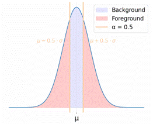
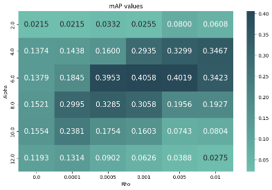
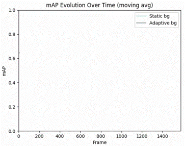
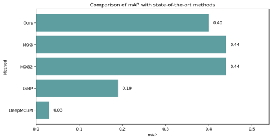

# Week 1: Background modeling - Model background information

In this directory, you can find the code used to perform the experiments in [Week 1](https://docs.google.com/presentation/d/1_xJVfqiP1mfACBZCyhPPKWU7jdSrVzTrUSHRYhuGjCg/edit#slide=id.p). Further explanations on the experiments and the corresponding qualitative results can be found in [Week 1 report](https://docs.google.com/presentation/d/1ahl211koLu9ac_TNh2huwtsZQ5SC2PDq5XXkzJ0G6rE/edit#slide=id.p).

## Contents
[➡️ Task 1.1: Gaussian Implementation](#task-11-gaussian-implementation)  
[➡️ Task 1.2: Gaussian Discussion](#task-12-gaussian-discussion)  
[➡️ Task 2.1: Adaptive Modelling](#task-21-adaptive-modelling)  
[➡️ Task 2.2: Adaptive vs Non-Adaptive Models](#task-22-adaptive-vs-non-adaptive-models)  
[➡️ Task 3: Comparison with the State of the Art](#task-3-comparison-with-the-state-of-the-art)


## Task 1.1: Gaussian Implementation

In the Gaussian modeling approach, we estimate the background by computing the mean/median and standard deviation for each pixel across the first 25% of frames.

Then, the other 75% of the frames are used to segment the foreground by using the following condition:
```plaintext
for all pixels i do
    if |I_i - μ_i| ≥ α * (σ_i + 2) then
        pixel → Foreground
    else
        pixel → Background
    end if
end for
```



The background model is then refined by selecting the median over the mean to prevent artifacts such as 'ghost' cars  appearing in the background.

### Our Pipeline:
1. Downsample frames by a factor of 4 to reduce memory consumption.
2. Convert RGB frames to CIELab to improve performance.
3. Compute median and standard deviation for each pixel across the temporal axis.
4. Apply foreground mask processing (closing, pixel suppression) to enhance object detection.

### Code:
The code that has been used to implement this task can be found in `src/task1.py`.

## Task 1.2: Gaussian Discussion

Interpretation the impact of alpha ($\alpha$):
- **Smaller $\alpha$**: More foreground pixels are detected, but more noise is introduced.
- **Larger $\alpha$**: Less noise, but objects with colors similar to the background may not be detected.

Post-processing is required to clean up foreground masks. Connected Components are used to detect objects, with a minimum threshold of 125 pixels to discard noise.

## Task 2.1: Adaptive Modelling

The adaptive model introduces a new parameter ($\rho$) that updates the Gaussian background distribution dynamically.

```
if pixel i ∈ Background then
    μ_i = ρ * I_i + (1 - ρ) * μ_i
    σ_i² = ρ * (I_i - μ_i)² + (1 - ρ) * σ_i²
end if
```

### Understanding $\rho$:
- **High $\rho$**: Faster adaptation but more noise.
- **Low $\rho$**: Slower adaptation but better stability.

### Selecting best $\alpha$ and $\rho$ to maximize mAP:
We performed a grid search. to find the optimal combination of both parameters. The results are shown in the following figure.



Using **$\alpha = 6$** and **$\rho = 0.001$**, we achieved the best mean average precision (mAP) of **$0.4058$**.

### Code:
The code that has been used to implement this task can be found in `src/task2.py`.

## Task 2.2: Adaptive vs Non-Adaptive Models

The adaptive model, by introducing an update mechanism (𝜌), outperforms the static Gaussian model in terms of mAP.
- **Static model ($\rho = 0$)**: Limited flexibility, leading to trade-offs between object definition and noise.
- **Adaptive model ($\rho \gt 0$)**: More resilient to lighting changes and gradual background variations.

Testing different color spaces (CIELab, YUV) showed that CIELab provided the best performance, aligning well with human perception.



## Task 3: Comparison with the State of the Art

The state-of-the-art methods chosen for benchmarking are:
- [MOG (OpenCV)](https://docs.opencv.org/3.4/d6/da7/classcv_1_1bgsegm_1_1BackgroundSubtractorMOG.html)
- [MOG2 (OpenCV)](https://docs.opencv.org/3.4/d7/d7b/classcv_1_1BackgroundSubtractorMOG2.html)
- [LSBP (OpenCV)](https://docs.opencv.org/3.4/de/d4c/classcv_1_1bgsegm_1_1BackgroundSubtractorLSBP.html)
- [DeepMCBM](https://arxiv.org/abs/2209.07923)

### mAP Comparison:

The following bar plot illustrates the obtained mAP for each of the methods:



### Code:
The code that has been used to implement the OpenCV models this task can be found in `src/task3.py`. On the other hand, the training and evaluation of DeepMCBM has been done using its official implementation, which can be found in this [GitHub repository](https://github.com/BGU-CS-VIL/DeepMCBM).
