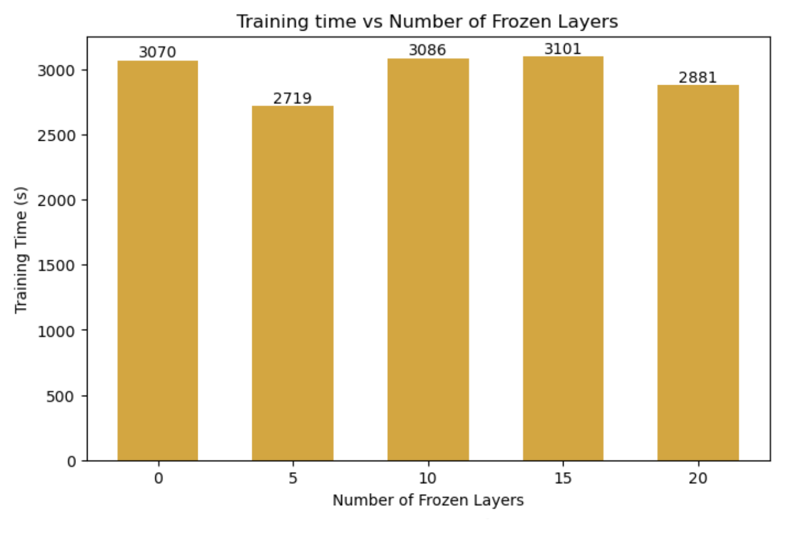
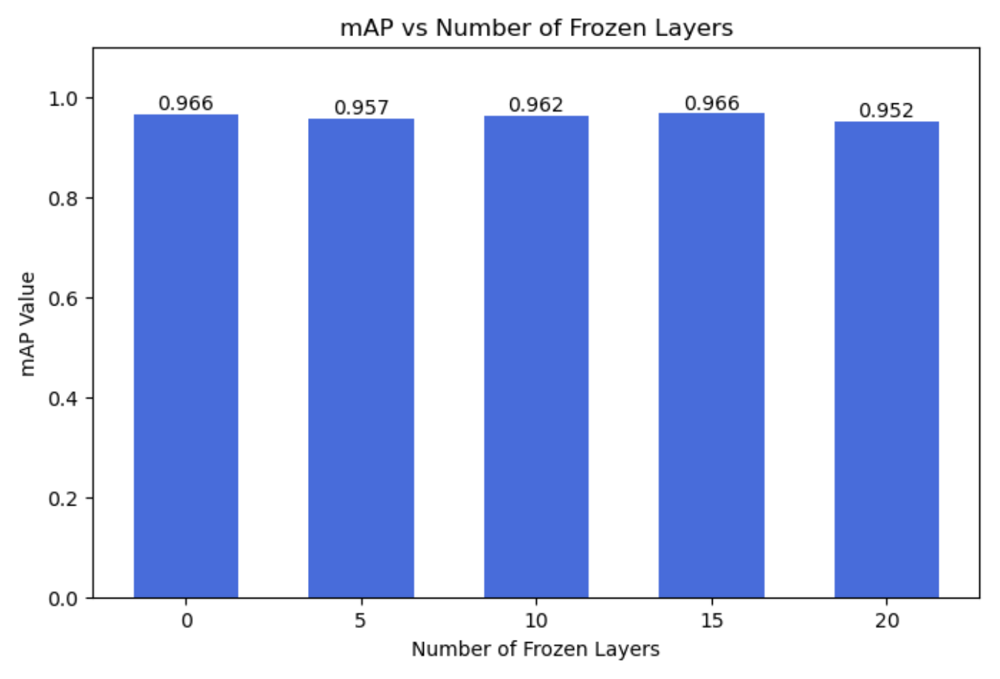
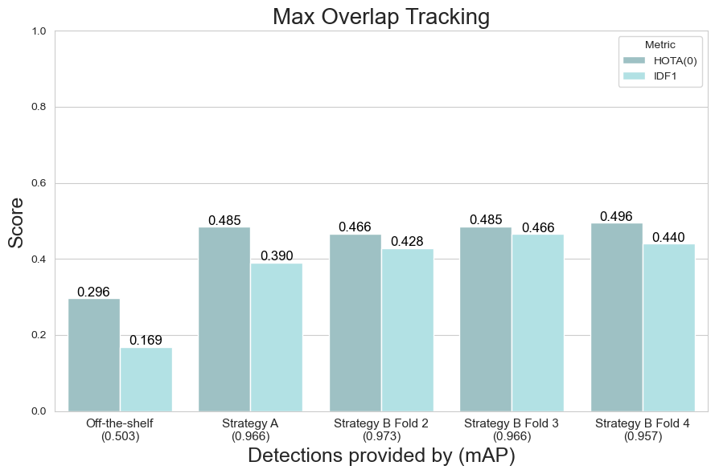
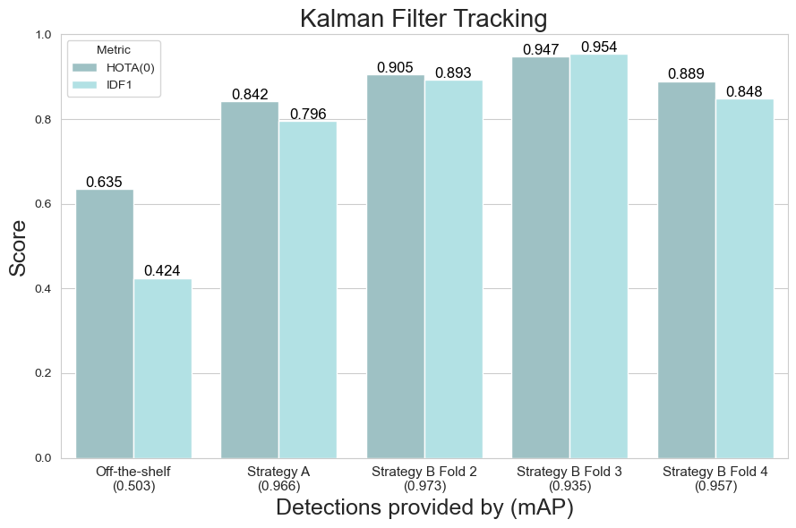

# Week 2: Object Detection - Tracking

In this directory, you can find the code used to perform the experiments in [Week 2](https://docs.google.com/presentation/d/1fEmYj3vuOOZ3HEOrYQzoxAS7faIJEvtebDRjRWDJ1Js). Further explanations on the experiments and the corresponding qualitative results can be found in [Week 2 report for Task 1](https://docs.google.com/presentation/d/17lopXVN5yTLmV9D4WNLUpHEstNSaVr50plXjcMj9LnA) and [Week 2 report for Task 2](https://docs.google.com/presentation/d/1xT7DNoxir8k8vc8JpcO5qdK7gY8q_jo5cAr7O9679fg).

## Contents

[⚙️ Setup](#⚙️-setup)  

[▶️ Running](#▶️-running)  

[➡️ Task 1: Object Detection](#➡️-task-1-object-detection)  
- [Task 1.1: Off-the-shelf](#task-11-off-the-shelf)  
- [Task 1.2: Fine-tune to your data](#task-12-fine-tune-to-your-data)  
- [Task 1.3: K-Fold Cross-validation](#task-13-k-fold-cross-validation)  

[➡️ Task 2: Object Tracking](#➡️-task-2-object-tracking)  
- [Task 2.1: Tracking by Overlap](#task-21-tracking-by-overlap)  
- [Task 2.2: Tracking with a Kalman Filter](#task-22-tracking-with-a-kalman-filter)  
- [Task 2.3: IDF1, HOTA scores](#task-23-idf1-hota-scores)  

## ▶️ Setup

### Dataset creation
Create a directory `week2/data` and place the data files `vdo.avi` (video) and `ai_challenge_s03_c010-full_annotation.xml` (ground truth annotations) inside it.

Then you can run the code to generate the dataset for YOLO (make sure you are working in `week2` directory):

```
cd week2
python yolo/utils/create_yolo_dataset.py
```

This will create the dataset required for object detection in your `week2/data` directory.

### WandB logging
To log your trainings in WandB, run the following command in your CLI:

```
yolo settings wandb=True
```

## ▶️ Running

### Training YOLOv11
To run training, set the desired data paths in a new or existing `.yaml` configuration file, found in `yolo/config`. Also set the desired parameters in the file `yolo/train_yolov11.py`. Then, you are ready to run training:

```
python yolo/train_yolov11.py
```

### Inference with YOLOv11
To run inference, you just need to adjust your custom parameters in the file `yolo/pred_yolov11.py`, and then run it:

```
python yolo/pred_yolov11.py
```

### Runing Maximum Overlap tracking and SORT tracking 
For the first one, just run the notebook `tracking/track2.1.ipynb` adjusting the required paths and other parameters, and for the second, also adjust the paths and parameters and run the file `tracking/track2.2.py` 

```
python tracking/track2.2.py
```

## ➡️ Task 1: Object Detection

### Task 1.1: Off-the-shelf
To do this first object detection we used a pre-trained model, YOLOv11x. The model was trained on the MS-COCO dataset, which includes 80 object categories. However, when applied to the dataset in this project, the initial performance—measured using the mean Average Precision (mAP@50)—was relatively low at 0.503.

Two key issues contributed to this lower-than-expected performance:

**Bounding Box Mismatches:** The model struggled with detecting parked cars accurately. Since these cars remained stationary throughout the video, minor misalignments in bounding boxes consistently degraded the overall mAP score.
**Class Assignment Issues:** The model classified only the bicycle itself, whereas the ground truth included both the bicycle and its rider as a single object. This mismatch led to classification errors and a reduction in precision.
To address these issues, further improvements were made through fine-tuning

### Task 1.2: Fine-tune to your data
Fine-tuning was performed using a subset of our video, specifically, 25% of the frames were used for training, while the remaining 75% were reserved for testing.

A key experiment involved freezing different numbers of layers (0, 5, 10, 15, 20) to analyze their impact on performance. Training was conducted for up to 300 epochs, with early stopping mechanisms to prevent unnecessary computations and avoid overfitting. Interestingly, there was no significant overfitting observed, as test losses were generally lower than training losses due to the effects of data augmentation.

After fine-tuning, the performance improved significantly, with the fine-tuned model achieving a much higher mAP score compared to the off-the-shelf version. The frozen layers experiment demonstrated that keeping all layers trainable (freezing 0 layers) provided the best results, leading to this configuration being used in subsequent experiments.




### Task 1.3: K-Fold Cross-validation
To evaluate the robustness of the fine-tuned model, two cross-validation strategies were tested:

**Sequential Splitting:** The dataset was divided into four sequential folds. The performance across these folds remained consistently high, with mAP@50 scores ranging from 0.935 to 0.973. However, some variations were noted, one fold showed slightly lower performance due to lighting changes in the video.

**Random Splitting:** In this approach, the dataset was randomly split into four folds, which resulted in unrealistically high mAP scores (~0.988). This was attributed to data leakage, as the model was trained and tested on consecutive frames, making them nearly identical.

## ➡️ Task 2: Object Tracking

### Task 2.1: Tracking by Overlap
The first tracking approach was a simple Intersection over Union (IoU)-based tracker. This method assignes a different ID to each bbox of the first frame, for the following ones what it does is:

1. Compute IoU between all bboxes from current frame and all bboxes from tracks identified in previous frame.
2. Check threshold* for all IoU scores obtained:
    - if IoU_score >= threshold: Bbox is assigned ID of track with highest IoU
    - else: Bbox is assigned a new unique  id
3. Save new tracks that appeared in this frame, getting rid of the preivous ones

*The optimal IoU threshold, determined through testing various values, was 0.3

However, this approach has notable limitations:

- It fails when objects temporarily disappear (e.g., due to occlusions), causing frequent ID changes.
- In scenarios where multiple objects are close together, ID swaps can occur, leading to inconsistent tracking.

Despite these limitations, tracking improved significantly when using detections from the fine-tuned model, reinforcing the importance of high-quality detections in tracking performance.

### Task 2.2: Tracking with a Kalman Filter
To address the weaknesses of the IoU-based tracker, a Kalman filter-based tracker was implemented using SORT (Simple Online Realtime Tracker). The Kalman filter predicts object locations in subsequent frames based on velocity and motion patterns, making it more robust than the overlap-based method. This approach provided several advantages:

- Better handling of missing detections: The tracker could maintain object identities even when detections were temporarily unavailable.
- Smoother trajectories: The motion model helped refine object positions, reducing abrupt ID changes.
- Improved robustness: The method was less sensitive to occlusions and noisy detections.

However, some tracking errors persisted. For instance:

- If an object (such as a van) followed a trajectory that didn't match the assumed motion model (e.g., taking a sharp turn), the tracker could misassign IDs.
- If an object was intermittently missed in detections, the tracker might fail to properly reassign its previous ID.


### Task 2.3: IDF1, HOTA scores
To quantitatively assess the performance of the two tracking methods, IDF1 and HOTA scores were used. These metrics measure how consistently an object retains the same ID across frames, factoring in both accuracy and association quality.

The Kalman-based tracker significantly outperformed the IoU-based tracker, achieving higher IDF1 and HOTA scores. This confirmed that incorporating motion modeling via Kalman filtering substantially improved tracking reliability.


Maximum overlap tracking on the left and Kalman on the right, beware that the y axis is different in both plots.


